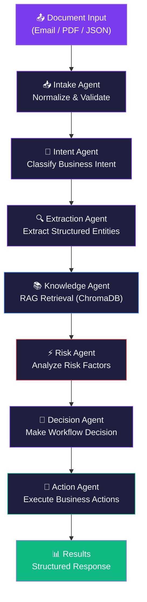

== 🧠 Multi-Agent Document Intelligence & CRM Automation Platform ==

A production-grade **Agentic AI** platform that intelligently processes business documents (emails, PDFs, JSON) through a pipeline of 7 specialized AI agents. Built with **LangGraph**, **LangChain**, **FastAPI**, and **ChromaDB** RAG.

---

== Architecture ==

---

== Agent Workflow ==

| # | Agent | Purpose | Technology |
|---|-------|---------|------------|
| 1 | **Intake Agent** | Detect file type, validate, normalize content | Deterministic (no LLM) |
| 2 | **Intent Agent** | Classify business intent with confidence | LLM + `with_structured_output()` |
| 3 | **Extraction Agent** | Extract entities using intent-specific schemas | LLM + Pydantic schemas |
| 4 | **Knowledge Agent** | Retrieve relevant business context via RAG | ChromaDB + LangChain |
| 5 | **Risk Agent** | Analyze fraud, compliance, and risk factors | LLM + `with_structured_output()` |
| 6 | **Decision Agent** | Make final workflow decision with reasoning | LLM + `with_structured_output()` |
| 7 | **Action Agent** | Execute business actions via LangChain tools | LangChain Tools |

= LLM Swapping =

The platform supports dynamic LLM provider switching:

    LLMFactory
    ├── Gemini Provider (langchain-google-genai)
    └── Groq Provider   (langchain-groq)

Set via environment variable or per-request override:
`LLM_PROVIDER=gemini  # or groq`

---

== Quick Start ==

= Prerequisites =

- Python 3.12+
- [uv](https://docs.astral.sh/uv/) package manager

= Setup =

    # Clone and navigate
    cd multi-agent-doc-intel

    # Copy environment config
    cp .env.example .env

    # Edit .env and add your API keys
    # Required: GOOGLE_API_KEY (for Gemini) or GROQ_API_KEY (for Groq)

    # Install dependencies
    uv sync

    # (Optional) Ingest knowledge base for RAG
    uv run python -m src.rag.ingestion

    # Start the server
    uv run python src/main.py

The app will be running at: **http://localhost:8000**
- Frontend: http://localhost:8000
- API Docs: http://localhost:8000/docs

= Docker =

    # Build
    docker build -t doc-intel .

    # Run
    docker run -p 8000:8000 --env-file .env doc-intel

---

== Environment Variables ==

| Variable | Description | Default |
|----------|-------------|---------|
| `LLM_PROVIDER` | Active LLM provider (`gemini` or `groq`) | `gemini` |
| `GOOGLE_API_KEY` | Google Gemini API key | (required for gemini) |
| `GROQ_API_KEY` | Groq API key | (required for groq) |
| `GEMINI_MODEL` | Gemini model name | `gemini-2.0-flash` |
| `GROQ_MODEL` | Groq model name | `llama-3.3-70b-versatile` |
| `LOG_LEVEL` | Logging level | `INFO` |
| `UPLOAD_DIR` | Temporary upload directory | `./uploads` |
| `CHROMA_PERSIST_DIR` | ChromaDB storage directory | `./chroma_db` |

---

== API Usage ==

= Health Check =

`curl http://localhost:8000/health`

= Process a Document (Text Input) =

    curl -X POST http://localhost:8000/documents/process \
    -F 'raw_text_input=From: alice@example.com
    Subject: URGENT: Service outage on account #12345

    Dear Support,
    Our production system has been down for 3 hours.
    Please escalate immediately.

    Best regards,
    Alice Johnson'

= Process a Document (File Upload) =

    curl -X POST http://localhost:8000/documents/upload \
    -F "file=@invoice.pdf"

= Process with LLM Override =

    curl -X POST http://localhost:8000/workflow/run \
    -H "Content-Type: application/json" \
    -d '{
    "raw_text_input": "{\"transaction_id\": \"TXN-789\", \"amount_usd\": 250000, \"origin_country\": \"Nigeria\"}",
    "llm_provider": "groq"
    }'

= Ingest Knowledge Base =

    # Via API
    curl -X POST http://localhost:8000/rag/ingest

    # Via CLI
    uv run python -m src.rag.ingestion

= Check Workflow Status =

`curl http://localhost:8000/workflow/status/{workflow_id}`

---

== RAG Knowledge Base ==

The `knowledge_base/` directory contains business documents for RAG:

    knowledge_base/
    ├── policies/
    │   └── crm_escalation_policy.md
    ├── regulations/
    │   └── compliance_guidelines.md
    └── examples/
    └── fraud_detection_rules.md

**To add your own knowledge:**
1. Add `.md` or `.txt` files to any subdirectory
2. Run ingestion: `uv run python -m src.rag.ingestion`
3. Documents are chunked and stored in ChromaDB for semantic retrieval

---

== Project Structure ==

    multi-agent-doc-intel/
    ├── src/
    │   ├── main.py                 # FastAPI application entry point
    │   ├── api/routes/             # API endpoint handlers
    │   ├── core/                   # Config, logging, LLM factory
    │   ├── graph/                  # LangGraph workflow (state, nodes, edges)
    │   ├── agents/                 # 7 specialized agents
    │   ├── rag/                    # RAG pipeline (ingestion, retrieval, vector store)
    │   ├── tools/                  # LangChain tools (CRM, email, validation, risk)
    │   ├── schemas/                # Pydantic models for all data structures
    │   └── services/               # Document parser, workflow orchestration
    ├── frontend/                   # Single-page web UI (HTML/CSS/JS)
    ├── knowledge_base/             # RAG knowledge documents
    ├── tests/                      # Test suite
    ├── .env.example                # Environment template
    ├── pyproject.toml              # Project config (uv)
    ├── Dockerfile                  # Container build
    └── README.md

---

== Testing ==

    # Run all tests
    uv run pytest tests/ -v

    # Run specific test file
    uv run pytest tests/test_schemas.py -v
    uv run pytest tests/test_llm_factory.py -v

---

== Tech Stack ==

| Layer | Technology |
|-------|------------|
| **Backend** | Python 3.12+, FastAPI |
| **Orchestration** | LangGraph, LangChain |
| **LLMs** | Google Gemini, Groq (LLaMA) |
| **RAG** | ChromaDB, LangChain Retrieval |
| **Schemas** | Pydantic v2 |
| **PDF Processing** | PyMuPDF |
| **Frontend** | HTML, CSS, Vanilla JavaScript |
| **Package Manager** | uv |
| **Container** | Docker |

---

== License ==

MIT
